## Hakkımda

Backend odaklı web uygulamaları ve veritabanı yapıları geliştiren bir **Bilgisayar Mühendisiyim** (Bartın Üniversitesi, 2026).
Ağırlıklı olarak JavaScript ekosisteminde çalışıyorum: **Node.js, Express.js ve PostgreSQL** ile RESTful API servisleri, veritabanı modelleri ve veri akışları kuruyor, **React** ile arayüz geliştiriyorum.
**JWT ile kimlik doğrulama, rol bazlı yetkilendirme ve ödeme altyapısı entegrasyonu** konularında staj ve proje deneyimim var; **FastAPI (Python)** ve **C#** ile de projeler geliştirdim.
Full-stack süreçlerde çalıştığım için backend kararlarını uygulamanın bütününü düşünerek alıyorum ve temiz, okunabilir kod yazmaya özen gösteriyorum.

<table><tr>
<td width="50%"></td>
<td width="50%"></td>
</tr></table>

## Deneyim

**Uzun Dönem Stajyer — Atakum Belediyesi** · Samsun · `02.2026 – 05.2026`
- Belediyenin web sitesi altyapısının yenilenmesi projesinde **Node.js, Express.js ve PostgreSQL** ile full-stack geliştirmeye katkı sağladım; **React** ile dinamik arayüzler geliştirdim.
- **RESTful API uç noktaları ve CRUD işlemleri** geliştirdim; **JWT tabanlı kimlik doğrulama** süreçlerinde görev aldım.
- **Sequelize ORM** ile veritabanı modellemesi yaptım, **StarUML** ile ER diyagramları hazırladım, seeder yapılandırmalarını oluşturdum.
- **Postman** ile API testleri yaptım; hata tespiti, sistem doğrulama ve içerik düzenleme çalışmalarına katıldım.

## Öne Çıkan Projeler

<table><tr>
<td width="50%"></td>
<td width="50%"></td>
</tr><tr>
<td width="50%"></td>
<td width="50%"></td>
</tr></table>

## Teknolojiler

  <b>Backend & Veri</b> 
    
  <b>Frontend</b> 
    
  <b>Diğer Diller & Araçlar</b> 
  

## Eğitim

**Bilgisayar Mühendisliği (Lisans)** — Bartın Üniversitesi · `2022 – 2026` · GNO **3,35 / 4,00**
 Veri Yapıları ve Algoritmalar · Veritabanı Yönetim Sistemleri · Yazılım Mühendisliği · Görsel Programlama · Bilgisayar Ağları · İşletim Sistemleri · Veri Madenciliği

## Sertifikalar

- Başlangıç Seviye Java ile Backend Web Development Patikası — *Patika.dev*
- Akbank Derin Öğrenmeye Giriş Bootcamp — *AI Business School*
- Python 202 Bootcamp — *AI Business School*
- Python ile Veri Analizi Atölyesi
- Yapay Zekaya Giriş · Büyük Veriye Giriş · Yapay Zeka Zirvesi 2024 — *BTK Akademi*

